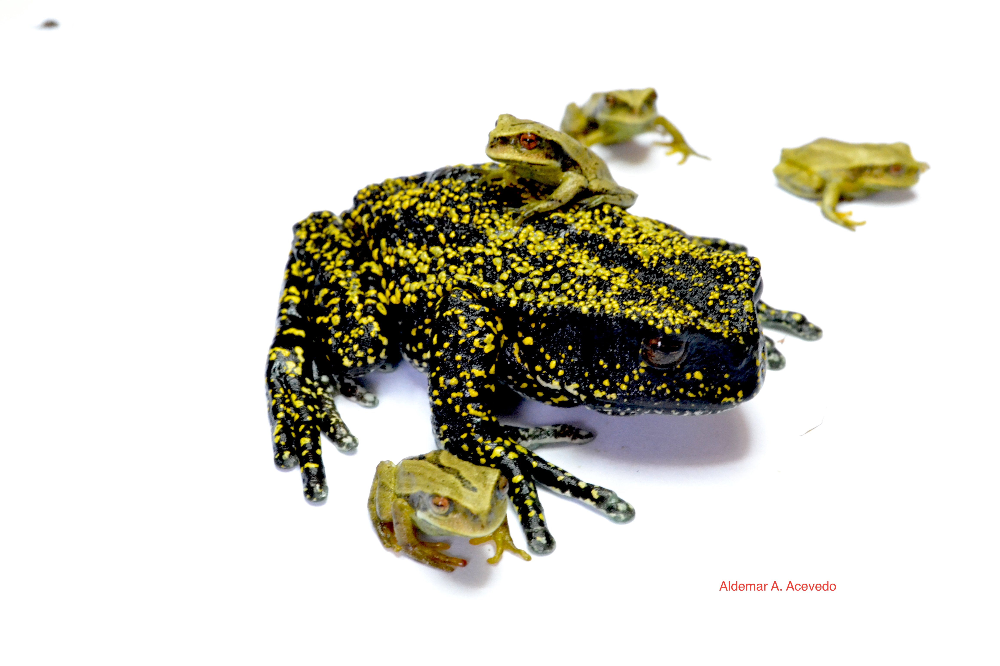

```{r setup, include=FALSE}
knitr::opts_chunk$set(echo = TRUE)
```

>**Albornoz-Espinel^1^, M. M., C. C??ceres-Mart??nez^2^, [A.A. Acevedo-Rinc??n^3^](http://acevedoaldemar.weebly.com). 2017. Protected areas assessment for the conservation of threatened amphibians in the Cordillera Oriental of Colombia. Herpetology Notes, 10:2017** [PDF](https://biotaxa.org/hn/issue/view/4203)

^1^ albornozm091@gmail.com
^2^ charli1391@gmail.com 

^3^ *Programa de Doctorado en Ciencias Biol??gicas, Laboratorio de Biolog??a Evolutiva, Pontificia Universidad Cat??lica de Chile, Avenida Libertador Bernardo O'Higgins 340, Santiago, Chile*


# **Abstract**

The global decline of amphibians is one of the greatest challenges in Conservation Biology. Several factors including pollution, climate change, emerging diseases and habitat destruction have accelerated the rate of decline in amphibian populations worldwide, which adds to their low representation in protected areas (PAs). In this study we assessed the level of protection of PAs for 52 species of threatened amphibians and the changes in land coverage inside and outside the protected areas of the Cordillera Oriental of Colombia. Between February 2015 and January 2016, we gathered occurrences from databases, biological collections and literature. The geographical records were georeferenced and overlaid on the layers of 190 PAs and on the layers of land coverage of the Cordillera Oriental. Our results confirmed the limited level of protection provided by PAs, where only 32 species represented in 158 out of 509 geographical records show a report within PAs, which are limited to 24 areas concentrated mainly in the central region of the Cordillera Oriental. At the same time, drastic changes are evident in the land coverage, which for most localities with occurrences between 30 and 10 years ago, are currently composed of mosaics of fragmented forests, crops and grasslands. This study demonstrates the need to establish priority actions and efficiently generate geographical areas of protection, in terms of coverage of the distribution of threatened amphibians in the Eastern region of Colombia.

```{r cars, echo=FALSE}

pacman::p_load(ggmap, ggplot2, dplyr, readr, leaflet, dygraphs, xts, lubridate, geojsonio)

Anfi2 <- read.table("Anfibios.csv", head=TRUE, sep=";" , dec=",")


saveRDS(Anfi2, "Anfi2.rds")
Anfi2 <- readRDS("Anfi2.rds")


pal1 <- colorFactor(heat.colors(3), Anfi2$Categoria)


```


**Map of northwestern Colombia, with geographical records of threatened amphibians in the Cordillera Oriental indicated by coloured circles. Several of the blue protected areas are clearly visible, attesting to their ineffectiveness for amphibian conservation.**


```{r pressure, echo=FALSE, fig.align="center", fig.height=8, fig.width=10}
leaflet(data = Anfi2) %>% addProviderTiles("Stamen.Terrain") %>% setView(-72, 6, zoom = 6) %>% addCircleMarkers(~longitude, ~latitude, popup = paste("Species:", Anfi2$name,"<br>","Red List Status:", Anfi2$Categoria, "<br>","Land cover:",Anfi2$Cobertura.vegetal, "<br>", "PAs:", Anfi2$Area.protegida, "<br>", "Date established as PA:", Anfi2$A.o.de.creacion, "<br>","IUCN Category",  Anfi2$CaIUCN, "<br>", "YOD-LYO:", Anfi2$YearD, "-", Anfi2$YearL, "<br>"), label = ~as.character(name), fillOpacity = 0.5, radius = 7, weight=15, fillColor = "black", color = ~pal1(Categoria), group = ~Categoria) %>% addLayersControl(
overlayGroups = ~Categoria, c("CR","EN","VU"),
    options = layersControlOptions(collapsed = FALSE))


```

---

**Parques Nacionales de Colombia. (2017): ??reas protegidas de Colombia. Available at: http://www.parquesnacionales.gov.co/portal/es/servicio-al-ciudadano/datos-abiertos/. Accessed on 01 November 2016.**


```{r echo=FALSE, out.width='65%'}

```


